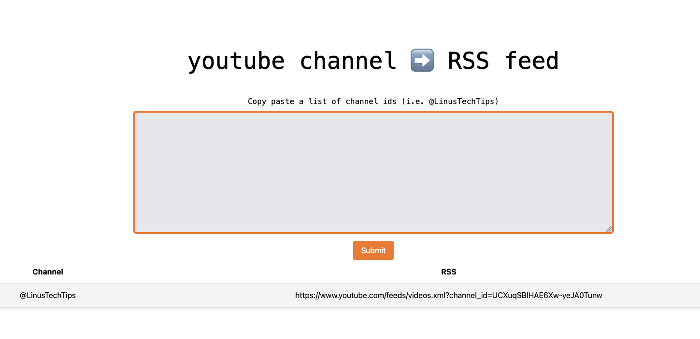

# ytb2rss

ytb2rss is a _lightweight_ and _simple_ flask app to convert a list
of youtube channels id into their RSS feeds. This RSS feeds can then
be imported into an RSS reader (i.e.
[freshRSS](https://freshrss.org/index.html)).

## First Look



## Usage

I currently have no accessible instance of the application but
anyone can self-host one following the instructions below.

### Run locally

To run in your home computer (with python installed), clone this
repository and use:

```bash
pip-compile requirements.in > requirements.txt
pip install -r requirements.txt
python3 app.py
```

### Build docker container

To run from the Docker image directly in your local machine, clone this
repository and use:

```bash
docker build -t ytb2rss .
docker run -p 5000:5000 ytb2rss
```

### Use our docker image and compose

Copy paste this docker-compose example in your directory:

```
services:
  ytb2rss:
    image: ghcr.io/davidmasp/ytb2rss:0.1.1
    restart: unless-stopped
    ports:
      - "5000:5000"
    networks:
      - caddy

networks:
  caddy:
    external: true
```

and run with:

```
docker-compose up -d
```


## Why


## Alternatives


